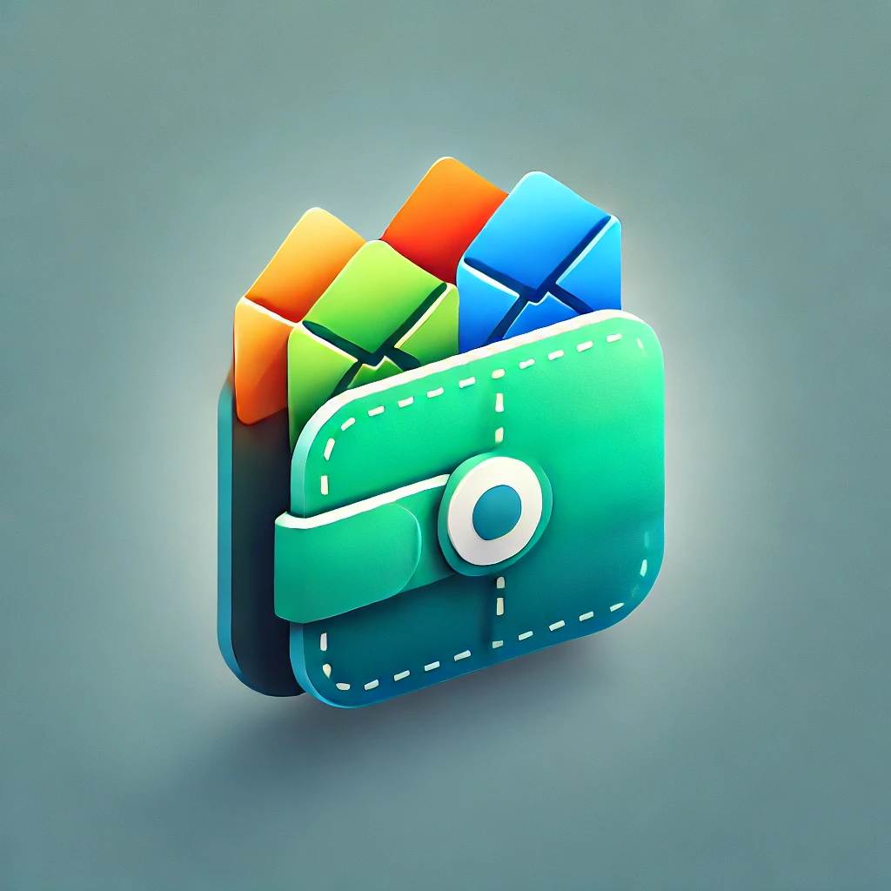

# freenance

A free personal finance management app.

Freenance is a simple mobile app made for expense tracking.

Create multiple Budgets, each budget can group several envelope and each envelope can group several operations.

Budget => Envelope => Operation

## Getting Started

This project is a starting point for a Flutter application.

A few resources to get you started if this is your first Flutter project:

- [Lab: Write your first Flutter app](https://docs.flutter.dev/get-started/codelab)
- [Cookbook: Useful Flutter samples](https://docs.flutter.dev/cookbook)

For help getting started with Flutter development, view the
[online documentation](https://docs.flutter.dev/), which offers tutorials,
samples, guidance on mobile development, and a full API reference.

## Generate sources

This project use generated sources for:

* state management
* tests mocks
* cucumber tests

### Generate sources using command line

Sources can be generated using the command line.

```bash
dart run build_runner build --delete-conflicting-outputs
```

### Generate sources using VsCode tasks

VsCode task has been created in order to generate sources using a simple shortcut.

1. Type `Cmd` + `Shift` + `P` to show the VsCode command palette.
2. Type `Run Task` select `Tasks: Run Task` and hit `Enter`
3. Now select `generate sources` and hit `Enter`

See [.vscode/tasks.json.vscode/tasks.json) for tasks definition.

## Generate App icon



This project use `flutter_launcher_icons` plugin from [pub.dev](https://pub.dev/) for icon management.

The icon root asset is located at [assets/icon/icon.png](./assets/icon/icon.png)

### Generate App icon using command line

To change icon follow these steps:

1. Replace the asset image in `assets/icon/icon.png`
2. Run the commande `dart run flutter_launcher_icons`

### Generate App icon using VcCode Tasks

VsCode task has been created in order to generate App icon using a simple shortcut.

1. Type `Cmd` + `Shift` + `P` to show the VsCode command palette.
2. Type `Run Task` select `Tasks: Run Task` and hit `Enter`
3. Now select `generate icon` and hit `Enter`

See [.vscode/tasks.json.vscode/tasks.json) for tasks definition.